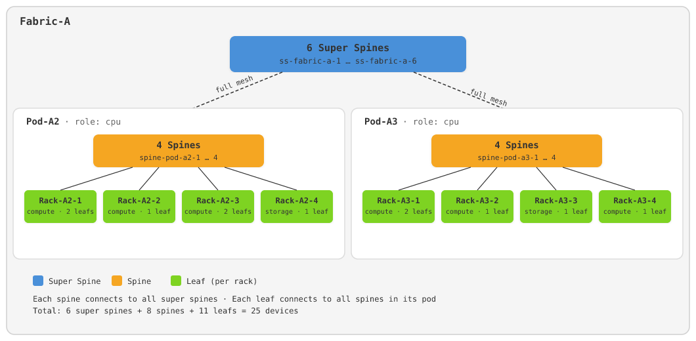

# Concept lab: Fabric-A Clos

This example is a **compiled xForm semantic lab**: a Containerlab package and
lab web UI generated from a data-center fabric diagram, then published in [`output/`](output/) so GitHub Pages can serve the static UI.

The same write-up lives in [`examples/conceptlab/`](../../../examples/conceptlab/).

**Live web UI:** [exergy-connect.github.io/xFrame.ai/examples/conceptlab/output/ui/](https://exergy-connect.github.io/xFrame.ai/examples/conceptlab/output/ui/)

That page is static hosting only. There is **no Docker daemon** behind GitHub
Pages, so **Deploy will not launch containers**. You can inspect the topology
canvas and generated files.

## Lab diagram

The source drawing is **Fabric-A**, a 5-stage Clos in the style of the
[Infrahub AI/DC demo](https://docs.infrahub.app/infrahub-solution-ai-dc/solution-ai-dc/demo-guide):

| Tier | Count | Naming in the compiled lab |
| --- | --- | --- |
| Super-spines | 6 | `SS1` … `SS6` |
| Pod-A2 spines | 4 | `S1-1` … `S1-4` |
| Pod-A2 leafs | 6 | racks with 2 / 1 / 2 / 1 leafs (`L1-…`) |
| Pod-A3 spines | 4 | `S2-1` … `S2-4` |
| Pod-A3 leafs | 5 | racks with 2 / 1 / 1 / 1 leafs (`L2-…`) |
| Hosts (added after the diagram) | 2 | Alpine `client1` / `client2` |

Cabling follows the diagram: every spine meshes to every super-spine; every
leaf meshes to every spine **in its pod**. The realized lab is 27 nodes
(25 fabric devices + 2 clients).

## How this lab was created

1. **Author a diagram.** The Clos picture above (and a matching addressing
   SVG) is the semantic input — counts, pod/rack roles, and mesh rules — not
   a hand-written node/link list.
2. **Image → sparse topology.** xForm’s `lab.from_image` capability sent the
   diagram to a Gemini model (`llm.complete`, with a fallback model). The
   model returned a Mode B fabric document (`module: [fabric, bgp]`, pods,
   racks, leaf counts) written as `topology-image2lab.xp` with
   `_id: fabric-from-image`.
3. **Add lab intent.** Addressing pools, IPv4+IPv6 fabric links (BGP
   unnumbered), tree layout, and two clients (default route via their leaf,
   `iperf3` + `dublin-traceroute` validation) were bound on that document.
4. **Compile the lab package.** Composing the semantic-lab framework with
   that topology and `--final clab.yml` expanded the Clos, assigned IPs,
   rendered FRR/Alpine bootstrap, and emitted the files now in [`output/`](output/):

   | Artifact | Role |
   | --- | --- |
   | `clab.yml` | Containerlab topology (`name: fabric-from-image`) |
   | `lab.sh` | Interactive lab CLI |
   | `config/` | Per-node initialize scripts and device configs |
   | `ui/index.html` | Lab web UI (topology canvas, terminals, deploy controls) |

5. **Publish the snapshot.** The compiled `output/` tree was copied here so
   the GitHub Pages site can host the UI without running the compiler on
   every visit.

## Open the example

The public image opens the compiled lab bundled in [`output/`](output/).
It does not compile labs.
